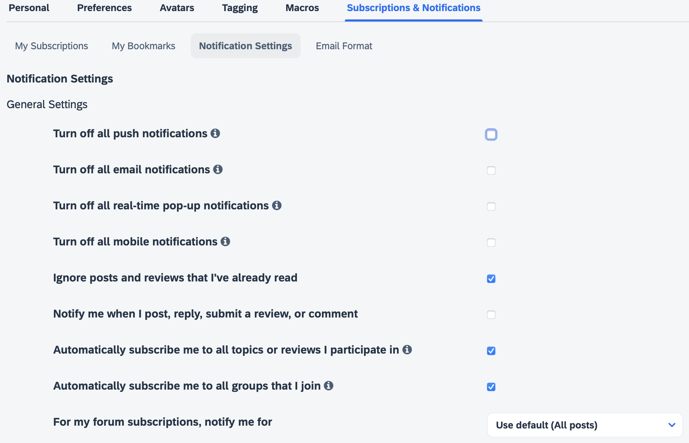
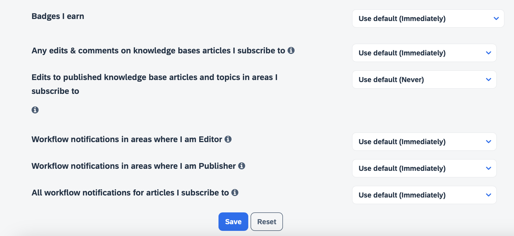
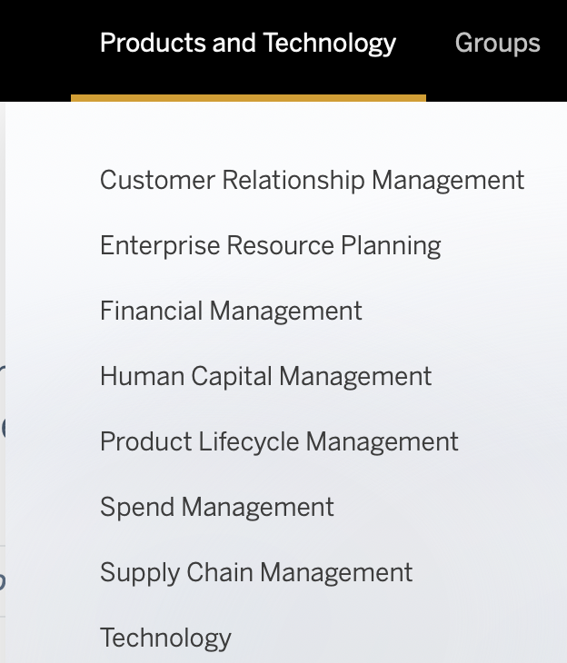
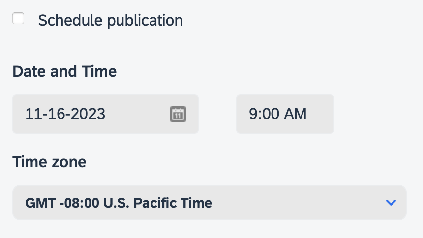

# Tour the SAP Community 2024
<!-- description --> Explore the various features, functionality, and aspects of the SAP Community, familiarize yourself with community guidelines, and discover how to get the most out of your membership.

## Prerequisites
 - If you do not already have an SAP user account and profile, [register for an account](https://accounts.sap.com/ui/public/showRegisterForm?spName=https%3A%2F%2Fhana.ondemand.com%2Fskywalker).
 - Go to [SAP Community](https://community.sap.com) and log in before starting the tutorial.

## You will learn
  - About key settings in your SAP profile
  - How to follow tags, content, and people
  - About the Rules of Engagement
  - About questions and blog posts

## Intro
Please note that our goal is to maintain a new version of the tutorial each year as we move forward to ensure everyone has a chance to explore all the new things coming to the platform.

SAP Community is SAP's destination for all things community. Our community hosts multiple areas for partners and customers, primarily providing public content accessible to visitors. Originally launched in 2003 as the SAP Developer Network (SDN), the site has progressed over the years and is now simply known as SAP Community, delivering a wealth of knowledge about all aspects of SAP technology, services, and products. 

### Set your display name

In order to participate fully in the SAP Community, you need to set your display name once you have registered via the SAP Universal ID process.

<!-- border -->

Your display name is what all other members can see when you post comments, ask questions, or write blog posts. The name should be professional, unique, and appropriate. For example if your name is "Sally Smith," you could use "sally.smith," "sallysmith," "sallys," "ssmith," or (perhaps your are lucky and no one has already claimed it) "sally."

Please do not use your login ID, email address, your company name, or a series of numbers or letters.

### Set your communications preferences

Notifications can let you know when something happens related to your published questions, blog posts, replies, comments, or around the topics you find interesting. The platform offers an extensive ability to fine-tune your notifications to meet your needs.

<!-- border -->
<!-- border -->
<!-- border -->
<!-- border -->

Go to the [My Settings](https://groups.community.sap.com/t5/user/myprofilepage/tab/personal-profile) (accessible by clicking your avatar in the upper right after the January 2024 migration, or from the [groups avatar](https://groups.community.sap.com/) prior to migration), select **Subscriptions & Notifications**, and choose which notifications you would like to receive.

<!-- border -->

**Note:** While there, be sure to select your default time zone under the **Preferences** tab.

### Review the Rules of Engagement - Part 1

Understanding the [SAP Community Rules of Engagement](https://community.sap.com/resources/rules-of-engagement) will allow you to be active in the community without encountering issues or negative feedback when you post a question, answer, or blog post. For example, when you try to publish a blog post, if you have not read the Rules of Engagement, the publishing process may be postponed because the blog post does not follow the Rules of Engagement.

This step covers the **Participation Etiquette** section of the Rules of Engagement.

1. Read the details of the **Participation Etiquette** section.

2. Answer the following question:

### Review the Rules of Engagement - Part 2

Understanding the [SAP Community Rules of Engagement](https://community.sap.com/resources/rules-of-engagement) will allow you to be active in the community without encountering issues or negative feedback when you post a question, answer, or  blog post. For example, when you try to publish a blog post, if you have not read the Rules of Engagement, the publishing process may be postponed because the blog post does not follow the Rules of Engagement.

This step covers the **Unacceptable Content** section of the Rules of Engagement.

1. Read the details of the **Unacceptable Content** section.

2. Answer the following question:

### Content and Interactions

Now that you have yourself sorted, you are ready to start taking full advantage of the platform. There are a couple of things we recommend to start with that will help you familiarize yourself with the platform and topics.

Your first step whenever you come some place new is to introduce yourself. We just so happen to have the perfect place for that!

<!-- border -->

Once there you can choose to "join" the group.

<!-- border -->

Now that you have "joined" the group, you are able to contribute to the conversations within that particular group, so why not take a [quick moment](https://groups.community.sap.com/t5/welcome-corner-blog-posts/welcome-all-sap-community-members-start-here/ba-p/5359) to say hello.  By taking this quick and easy step, you'll already receive a special thank you from the SAP Community.

We have a wide selection of groups to choose from. Feel free to explore and join others.

<!-- border -->

### Staying up to date

We have a dedicated space for new information related to the SAP Community, new groups being added, new features and functionalities, and so on. Your next quick step into the community is around your subscriptions.

Head over to the [What's New](https://groups.community.sap.com/t5/what-s-new/bg-p/whats-new) area and there you will see **Options** on the right-hand side. Click that and select **Subscribe**.

<!-- border -->

This will now keep you informed whenever we send out updates.

### Knowing when the next events are happening

We have a dedicated section allowing you to **subscribe** to [events](https://groups.community.sap.com/t5/events/ct-p/events). You can RSVP, comment, and even watch livestreams.

<!-- border -->

Here you can view things in either a list view or a calendar view, filter, subscribe, and more.

### Asking questions and seeking help

With a wealth of knowledge already available, our Q&A areas can provide you with the answers you need. If you can't find an answer though, you can simply ask your question directly.

<!-- border -->

Our blogging areas may also be the destination of choice for learning about topics and how others have been working with various products and technology. You can share your own knowledge here as well.

<!-- border -->

### Authoring blog posts

The next several steps will help you prepare and manage your blog posts on SAP Community, provide tips for better blogging, and teach you how to interact with readers. They cover our blogging guidelines, expectations, and processes related to blogging within the platform.

 **Please note:** If you were previously a blogger within the SAP Community and you are not able to submit blog posts today, you should be able to resolve this issue by completing this tutorial. If not, please contact <a href="mailto:community@sap.com">community@sap.com</a>.

 ### Guidelines make everything better!

The SAP Community is an inclusive environment that has multiple personas, roles, and types of users, so it is important to us that you are familiar with our own blogging guidelines and Rules of Engagement. Blogging and community are not new topics, and each destination on the internet has its own variations. SAP Community is no different. You should have read our [Rules of Engagement](https://community.sap.com/resources/rules-of-engagement) earlier, but please be sure to review our terms before continuing. 

<!-- border -->

Additional points to keep in mind when starting your blogging journey. 

- Employees are subject to additional guidelines that can be found within our internal resources.
- A blog post is a snapshot in time; these are not meant to be continuously updated or modified over extended periods of time.
- A blog post is not a tutorial. A blog post can reference a tutorial but should not be the tutorial itself.
- In this case, a tutorial and "how to" are similar.

Please familiarize yourself with the Rules of Engagement, then answer the following.

### Get to know the blogging tool

To submit your blog post, you will first need to decide the appropriate spot within the community for your post. Is it a group? Or one of our product-related areas? (Note that the image below shows the navigation as it will appear after our January 2024 migration.)

<!-- border -->

For the purposes of this tutorial, we will assume you are selecting an area within the **Products and Technology** section for your blog post. Each area is set up in a similar manner. 

<!-- border -->

As an SAP employee, you should select the "Blogs by SAP" section. If you aren't an employee, you should select "Blogs by Members." Once you've made the appropriate selection, you should click **Create a Blog Post**, which then opens the blogging tool.

<!-- border -->

The primary elements of the blogging tool can easily be broken down into these three sections: "Title," "Teaser," and "Body"

The title should be something readable by the user and easily understood. Avoid clickbait titles as the SAP Community audience avoids those posts.

<!-- border -->

The "Teaser" is optional and can be skipped. If you choose to use it though, this can be something catchy or central to your post that you can add or copy and paste in to help readers decide if they would like to open your post.

<!-- border -->

And finally the "Body" is the heart of your post and contains the primary information.

<!-- border -->

If you need a bigger window to work in, you can click and drag the symbol in the bottom right corner to enlarge the area.

<!-- border -->

Please familiarize yourself with the tool and the advice above, then answer the following.

### Use tags

Once you decide where you will write, you'll need to select tags that match the topics that your blog post covers. Please read the **SAP Managed Tags** section of the [Help](https://groups.community.sap.com/t5/help/faqpage/title/Associated_Products) page to learn more.

<!-- border -->

You must enter at least one SAP Managed Tag, and you may use up to seven.

There are also article tags that allow you to further refine your content with additional meta information. These are free-form tags and should be used with consideration for the reader and how they would interpret the terms.

<!-- border -->

### Know your audience

SAP Community brings together people from all around the world and from all aspects of the SAP ecosystem, and by learning how to write relevant content for them, you'll draw a larger audience and increase readership for your blog post. 

When preparing a blog post, you should write in your voice -- so that you can establish yourself as an expert while growing your reputation and building your professional network. 

Reviewing our content, we have found that blog posts following a three-act structure -- with a clear introduction, body, and conclusion -- ensure the best readability. These posts perform better and draw more readers compared to posts without this structure. 

Finally, once you've published your blog post, you have the opportunity to promote it and interact with your audience. If your post does well, there is a chance that it may be featured within the site or social media. In those cases, a cover photo may be added if one does not exist. (If you add a cover photo yourself, please ensure that its dimensions are 600 x 420 pixels.)

<!-- border -->

### One last thing about blogging

As your progress in your journey and climb up the SAP Community "rank ladder," you will unlock additional permissions such as being able to publish directly and even scheduling your post for publication. (New bloggers may have their posts go through moderation, and curators/owners for certain groups may need to review posts prior to publication to decide whether the content is relevant for their areas.)

<!-- border -->

### Final thoughts about SAP Community

We believe that community is for everyone, and we welcome you to ours! We are here to help you on your learning journey!
