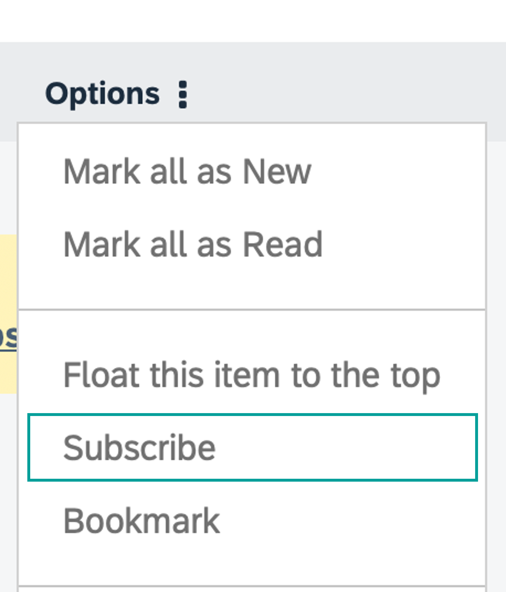

# Tour the SAP Community 2024
<!-- description --> Explore the various features, functionality, and aspects of the SAP Community, familiarize yourself with community guidelines, discover how to get the most out of your membership, and earn the Tour the Community badge.

## Prerequisites
 - If you do not already have an SAP user account and profile, [register for an account](https://accounts.sap.com/ui/public/showRegisterForm?spName=https%3A%2F%2Fhana.ondemand.com%2Fskywalker).
 - Go to [SAP Community](https://community.sap.com) and log in before starting the tutorial.

## You will learn
  - About key settings in your SAP profile
  - How to follow tags, content, and people
  - About the Rules of Engagement
  - About questions and blog posts

## Intro
Please note that our goal is to maintain a new version of the tutorial each year as we move forward to ensure everyone has a chance to explore all the new things coming to the platform. With the completion of the tutorial, you will receive the Tour the SAP Community 2024 badge! 

SAP Community is SAP's destination for all things community. Our community hosts multiple areas for partners and customers, primarily providing public content accessible to visitors. Originally launched in 2003 as the SAP Developer Netowrk (SDN), the site has progressed over the years and is now simply known as SAP Community, delivering a wealth of knowledge about all aspects of SAP technology, services, and products. 

---

### Set your display name

In order to participate fully in the SAP Community, you need to set your display name once you have registered avia the SAP Universal ID process.

<!-- border -->

Your display name is what all other members can see when you post comments, ask questions, or write blog posts. The name should be professional, unique, and appropriate. For example if your name is "Sally Smith," you could use "sally.smith," "sallysmith," "sallys," "ssmith," or (perhaps your are lucky and no one has already claimed it) "sally."

Please do not use your login ID, email address, your company name, or a series of numbers or letters.

### Set your communications preferences

Notifications can let you know when something happens related to your published questions, blog posts, replies, comments, or around the topics you find interesting. The platform offers an extensive ability to fine-tune your notifications to meet your needs.

<!-- border -->
<!-- border -->
<!-- border -->
<!-- border -->

Go to the [My Settings](https://groups.community.sap.com/t5/user/myprofilepage/tab/personal-profile) (accessible by clicking your avatar in the upper right after the January 2024 migration, or from the [groups avatar](https://groups.community.sap.com/) prior to migration), select **Subscriptions & Notifications**, and choose which notifications you would like to receive.

<!-- border -->

**Note:** While there, be sure to select your default time zone under the **Preferences** tab.

### Review the Rules of Engagement - Part 1

Understanding the [SAP Community Rules of Engagement](https://community.sap.com/resources/rules-of-engagement) will allow you to be active in the community without encountering issues or negative feedback when you post a question, answer, or blog post. For example, when you try to publish a blog post, if you have not read the Rules of Engagement, the publishing process may be postponed because the blog post does not follow the Rules of Engagement.

This step covers the **Participation Etiquette** section of the Rules of Engagement.

1. Read the details of the **Participation Etiquette** section.

2. Answer the following question:

### Review the Rules of Engagement - Part 2

Understanding the [SAP Community Rules of Engagement](https://community.sap.com/resources/rules-of-engagement) will allow you to be active in the community without encountering issues or negative feedback when you post a question, answer, or  blog post. For example, when you try to publish a blog post, if you have not read the Rules of Engagement, the publishing process may be postponed because the blog post does not follow the Rules of Engagement.

This step covers the **Unacceptable Content** section of the Rules of Engagement.

1. Read the details of the **Unacceptable Content** section.

2. Answer the following question:

### Content and Interactions

Now that you have yourself sorted, you are ready to start taking full advantage of the platform. There are a couple of things we recommend to start with that will help you familiarize yourself with the platform and topics.

Your first step whenever you come some place new is to introduce yourself. We just so happen to have the perfect place for that!

<!-- border -->

Once there you can choose to "join" the group.

<!-- border -->

Now that you have "joined" the group, you are able to contribute to the conversations within that particular group, so why not take a [quick moment](https://groups.community.sap.com/t5/welcome-corner-blog-posts/welcome-all-sap-community-members-start-here/ba-p/5359) to say hello.  By taking this quick and easy step, you'll already receive a special thank you from the SAP Community.

We have a wide selection of groups to choose from. Feel free to explore and join others.

<!-- border -->

### Staying up to date

We have a dedicated space for new information related to the SAP Community, new groups being added, new features and functionalities, and so on. Your next quick step into the community is around your subscriptions.

Head over to the [What's New](https://groups.community.sap.com/t5/what-s-new/bg-p/whats-new) area and there you will see the **"options"** on the right hand side and select **Subscribe**.

<!-- border -->

This will now keep you informed whenever we send out updates.

### Knowing when the next events are happening

We have a dedicated section allowing you to **subscribe** to [events](https://groups.community.sap.com/t5/events/ct-p/events). You can RSVP, comment, and even watch livestreams.

<!-- border -->

Here you can view things in either a list view or a calendar view, filter, subscribe, and more.

### Asking Questions and Seeking Help

With a wealth of knowledge already available, our Q&A areas can provide you with the answers you need. If you can't find an answer though, you can simply ask your question directly.

<!-- border -->

Our blogging areas may also be the destination of choice for learning about topics and how others have been working with various products and technology. You can share your own knowledge here as well. For blogging, a special set of permissions is required -- so be sure to complete the [blogging tutorial](https://developers.sap.com/tutorials/community-blogging.html) to get started.

<!-- border -->

### Next Steps

We believe that community is for everyone, and we welcome you to ours! We are here to help you on your learning journey!

